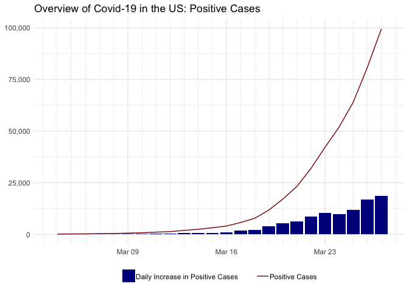
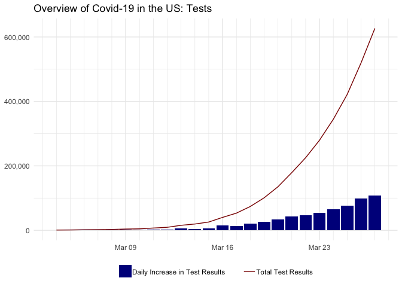

Data Sources
------------

In this project, we use the data from [The COVID Tracking
Project](https://covidtracking.com) and [Johns Hopkins
dataset](https://github.com/CSSEGISandData/COVID-19/tree/master/csse_covid_19_data/csse_covid_19_time_series).
We also use US states population data (uploaded in Github) in order to
understand the spread and testing of the virus from the per capita
perspective.

Overview of The Spread of Covid-19 in the US
--------------------------------------------

