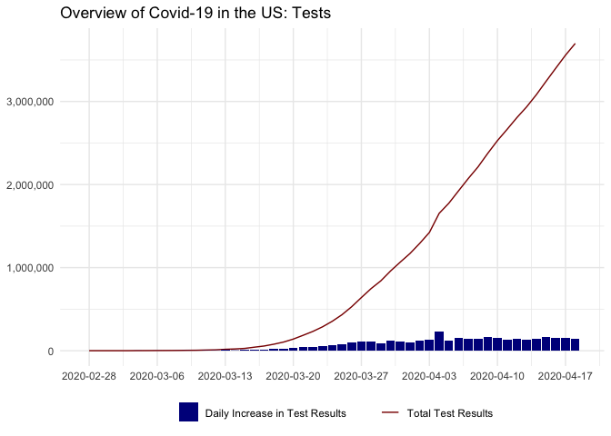
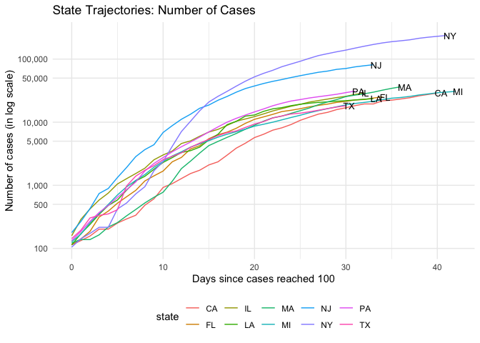
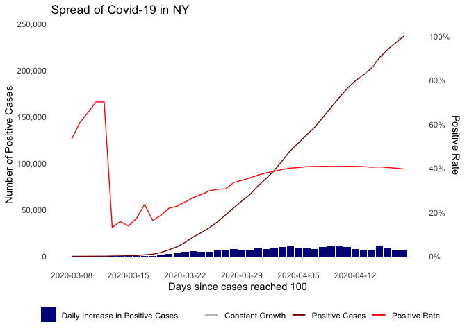

The goal of this report is to visualize the spread of Covid-19 and to
understand the current situation in terms of where we are in the
spreading trajectory. In the first part of this report, we overview the
spread of Covid-19 across the globe. We then move onto the spread of the
disease in the US with a closer scrutiny at the US data at state-level.

In this report, we use the data from [Johns Hopkins
dataset](https://github.com/CSSEGISandData/COVID-19/tree/master/csse_covid_19_data/csse_covid_19_time_series)
(also uploaded in the current repository) for the global overview and
the data from [The COVID Tracking Project](https://covidtracking.com)
for understanding the development in the US. We also use US states
population data (uploaded in this repo) in order to understand the
spread and testing of the virus from the per capita perspective.

Due to the different testing and social distancing policies across the
globe and across the states in the US, direct comparisons among the
countries and states may be misleading. As such, the use of the figures
in the report as means of prediction is discouraged.

This report is written with the data as of March 29th, 2020.

## International Overview of the Spread of Covid-19

Covid-19 began spreading in China around the beginning of 2020 and was
spreaded globally rapidly with around 720,000 people infected with the
disease.

<!-- -->

``` r
# number of countries reaching 100
    dat_international_100 = dat_international %>% 
      spread(date, cases) %>%
      mutate_if(is.numeric, function(x) as.numeric(x >= 100))
    dat_international_100 = data.frame("date" = as.Date(colnames(dat_international_100)[-1]), 
                              "number_of_countries" = colSums(dat_international_100[,-1]))

# number of countries reaching 1000
    dat_international_1000 = dat_international %>% 
      spread(date, cases) %>%
      mutate_if(is.numeric, function(x) as.numeric(x >= 1000))
    dat_international_1000 = data.frame("date" = as.Date(colnames(dat_international_1000)[-1]), 
                              "number_of_countries" = colSums(dat_international_1000[,-1]))
```

The disease has been spreading in 177 countries and regions. There are
105 countries and regions with over 100 confirmed cases of Covid-19, and
43 countries and regions with over 1,000 confirmed cases. These numbers
are growing
rapidly.

<!-- --><!-- -->

Among these countries and regions, the following are the most
hard-hitted places. \[1\]

    ## # A tibble: 10 x 2
    ##    `Country/Region` `Number of Confirmed Cases`
    ##    <chr>                                  <dbl>
    ##  1 US                                    140886
    ##  2 Italy                                  97689
    ##  3 Spain                                  80110
    ##  4 Hubei                                  67801
    ##  5 Germany                                62095
    ##  6 France                                 40708
    ##  7 Iran                                   38309
    ##  8 UK                                     19780
    ##  9 Switzerland                            14829
    ## 10 China ex Hubei                         13643

The following figure visualizes the trajectory of the spread of Covid-19
in some of the countries and regions. In particular, for each country or
region, we define the date when the number of confirmed cases of
Covid-19 as the date of the “outbreak” and plot how the cumulative
number of confirmed cases evolves after the outbreak.\[2\]

It seems that China (both Hubei Province and the rest of China) and
South Korea has controlled the spread with very limited daily growth in
the number of confirmed cases roughly a month after their outbreaks (day
30). The disease is growing at a somewhat controlable rate after the
outbreak in some of the other Asian countries and regions, including
Japan, Singapre Hong Kong and Taiwan. The rest of the countries in the
figure have roughly close-to-linear trajectories, meaning that the
disease is still growing at the exponential rate in these places
\[3\]

<!-- -->

We emphasize again that the number of confirmed cases in each country is
affected by its testing policy and capacity, which are not uniform
across the world. Moreover, countries with similar total number of
confirmed cases may differ in the severity of the spread of Covid-19,
due to the difference in total population.

## The Spread of Covid-19 in the US

Currently, the US has NA,000 confirmed cases of Covid-19, making it the
country with the most cases. In this part of the report, we break down
the US data at the state-level and incorporate the testing data from the
CovidTracking Project to better understand the spread of the disease in
the
US.

<!-- -->

The figure above captures the spread of the disease in the US in terms
of the total confirmed cases (tested with the positive result) and the
daily increaments of the cases. The rapid growth in the number of
positive cases reflects the rapid growth in the testing capacity\[4\] in
the US. The ability to test Covid-19 infection is foundamental in
containing the virus, as carriers of the virus may be
asymptomatic.

<!-- -->

### Spread of Covid-19 at State Level

We visualize the trajectory of the spread of Covid-19 for the top 10
states in terms of total number of cases and the number of cases per
million population. The latter metric is meanful since it measures the
severity of the spread relative to the population. We define an outbreak
in a state as the day when the number of cases reaches
100.

<!-- -->

We observe from the above figure that WA, NY and CA are the first three
states where the outbreak started: The outbreak occurred more than 20
days ago in these state. NY, which is the state with the most cases of
Covid-19, has 59513, 13386, 5708, 5486, 4955, 4596, 4310, 4246, 3540,
3394, 2651, 2552, 2061, 1993, 1653, 1537, 1514, 1239, 1112, 1040, 919,
890, 838, 806, 774, 758, 738, 719, 548, 503, 429, 426, 394, 342, 336,
319, 294, 261, 253, 237, 235, 232, 214, 154, 151, 127, 113, 108, 102,
98, 90, 86, 56, 23, 2, NA people contracting the virus. Covid-19 has
been spreading rapidly in NJ and MI: No other state has seen more cases
of Covid-19 than NJ and MI ten days after the outbreak. Notice that we
use log-scale for the number of cases in this
figure.

<!-- -->

The trajectories of the spread of the disease normalized by population
tell a slightly different story, since it measures the severity of the
spread relative to the total population. The situation in NY is still
the worst, followed by NJ. However, the gap between NY and NJ is much
smaller in terms after being normalized by population. CT, VT and DC are
among the top 10 states according to this metric, while CA is no longer
among the top 10.

### Testing of Covid-19 at State Level

Testing of Covid-19 is essential since it is the first step to isolating
the infected people and containing the virus. We have already seen a
rapid growthing in the number of tests implemented in the US, and we
break it down at the state
level.

<!-- -->

<!-- -->

### Positive Rate

``` r
df_test = df_current %>%
  mutate(pos_rate = positive / totalTestResults) %>%
  select(state, positive, totalTestResults, pos_rate, test_per_million_pop) %>%
  filter(positive >= 100)

national_avg = df_current %>% 
  ungroup() %>%
  summarise(avg_positive_rate = sum(positive, na.rm = TRUE) / sum(totalTestResults, na.rm = TRUE),
            avg_test_per_million_pop = round(sum(totalTestResults, na.rm = TRUE) / sum(population, na.rm = TRUE) * 1000000))

slope = as.numeric(national_avg[1])
l = function(x) log10(slope * x)

title = paste0("COVID19 Testing in US - National Average: \nPositive Rate: ", 
               round(national_avg[1] * 1000) / 10, 
               "%; Tests per Million Population: ", 
               round(national_avg[2]))

state_list = c("NY", "WA", "CA", "NJ", "NC", "DC", "DE", "MI") # these are the states with labels

ggplot(df_test, aes(x = totalTestResults, y = positive, size = test_per_million_pop, color = pos_rate, label = state)) +
  geom_point(alpha = 0.5) +
  geom_text(cex = 2.5, color = "black") +
  geom_label(data = df_test %>% filter(state %in% state_list), 
             aes(label = paste0(round(pos_rate * 100), "%; ", test_per_million_pop)),
             cex = 2.5, color = "black", nudge_y = 0.08, alpha = 0.05) +
  scale_color_gradient(low = "yellow2", high = "red3", name = "Positive Rate") +
  scale_size(range = c(3, 16), breaks = c(250, 500, 1000, 2000, 4000, 8000), name = "Test Per Million Pop") +
  stat_function(fun = l, linetype = "dashed", show.legend=FALSE) +
  scale_y_log10(labels = scales::comma) +
  scale_x_log10(labels = scales::comma) +
  xlab("total tests (log scale)") + ylab("total cases (log scale)") +
  ggtitle(title) +
  theme_minimal() + theme(legend.position = "right")
```

<!-- -->

This figure is made based on the latest data. The dashed line represents
the national average positive rate: about 17 people are infected by the
Coronavirus our of every hundred people tested. Each “bubble” in the
figure represents a state and is placed according to the number of tests
and number of cases of Covid-19 (in log-scale). The color of a “bubble”
captures the positive rate of the tests performed by the state and the
size of a “bubble” captures the number of tests performed per million
population.

1.  Notice that we treat Hubei Province and the rest of China
    separatedly in our report.

2.  We set the outbreak of Hubei Provence as Jan 19. While data is not
    available from JHU before Jan 22, we have checked from other data
    source that the number of confirmed cases has reached 100 for Hubei
    on that day.

3.  This is because the y-axis has log-scale in this figure.

4.  Tests with pending results are excluded.
