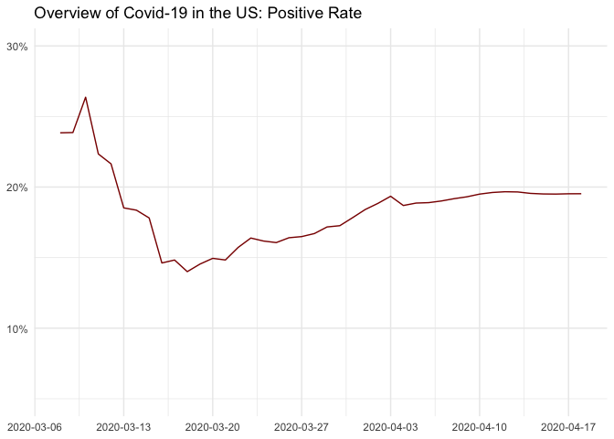
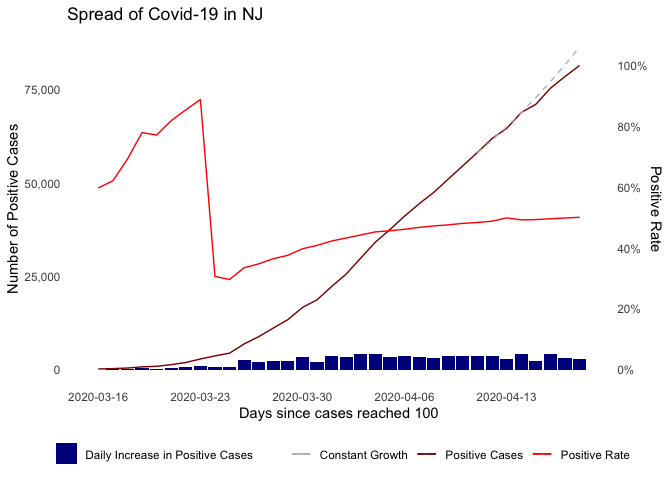
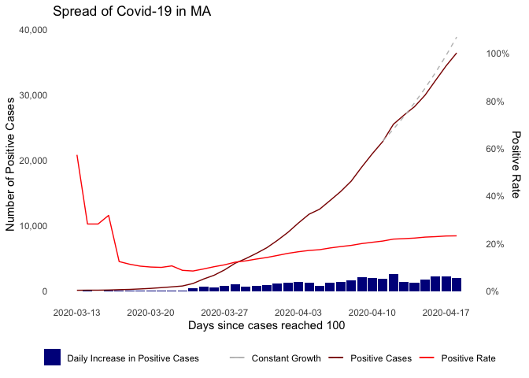
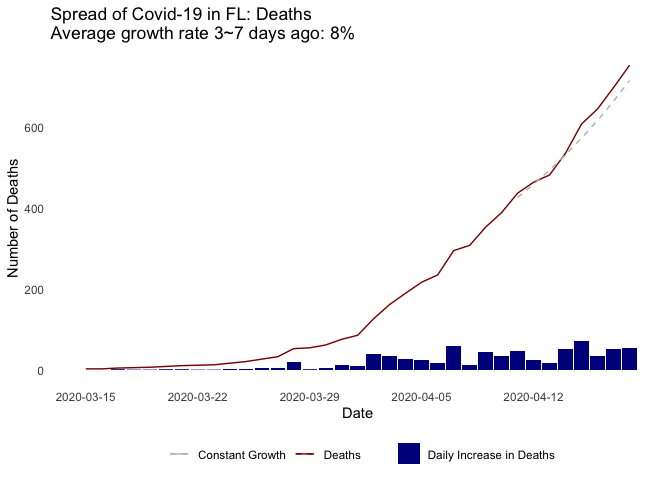
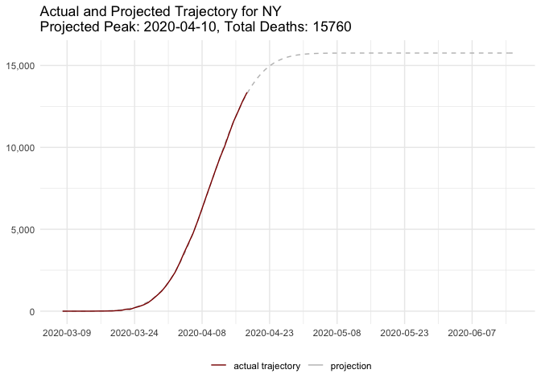
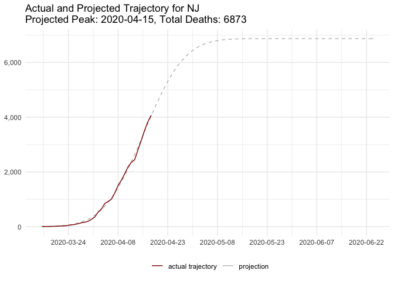
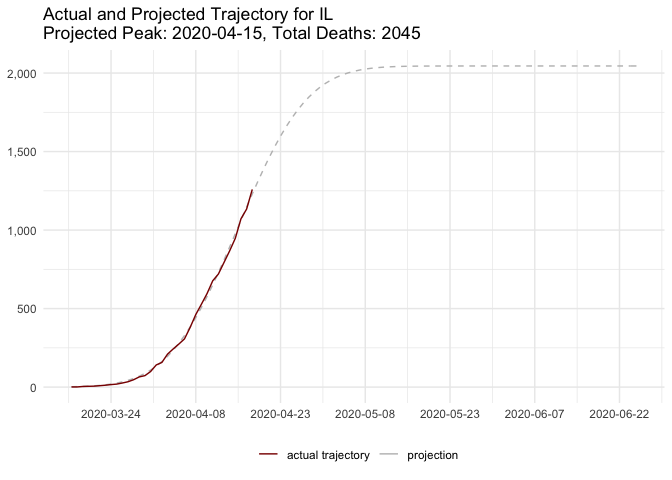

# Visualizing Covid-19 Data

## TLDR

  - Covid-19 has been spreading globally with over 2,000,000 people
    infected. Over 700,000 people are infected by Covid-19 in the US.
    Disease containment efforts are relatively more effective in some
    Asian countries and regions.
  - In ths US, the growth in confirmed cases has become slower recently.
    However, there is also a signal of inadequate testing. The metric,
    positive rate of Covid-19 tests, can be used to measure the
    sufficiency of tests relative to the spread of the disease. It grows
    from 15% to 20% in the past month.
  - Cross-state comparisons are possible despite the variation in
    testing policies. It can be done by jointly analyzing positive rate
    and number of tests per million population – For two states with
    similar numbers of tests per million population, positive rate is a
    proxy for the severity of the spread of Covid-19.
  - The number of deaths is a more reliable metric than the number of
    positive cases. The situation in some states (such as NY) starts to
    stablize according to this metric. A projection of the trajectory of
    Covid-19 is done based on a simplified version of
    [IHME’s](https://covid19.healthdata.org/united-states-of-america)
    method. Similar results are reproduced.

## Introduction

The goal of this report is to visualize the spread of Covid-19 and to
understand the development of this public health crisis. We begin by a
brief overview of the spread of Covid-19 across the globe and in the US.
We then move onto the closer analysis of the US data at state-level. In
particular we visualize the trajectory of the spread across time for
individual states as well as compare the states and making projections.

In this report, we use the [Johns Hopkins
dataset](https://github.com/CSSEGISandData/COVID-19/tree/master/csse_covid_19_data/csse_covid_19_time_series)
(also uploaded in the current repository) for the global overview and
the data from [The COVID Tracking Project](https://covidtracking.com)
for understanding the development in the US since it has testing
information. We also use US states population data (uploaded in this
repository) in order to understand the spread and testing of the virus
from the per capita perspective.

This report is written with the data as of April 18th, 2020.

## Overview of the Spread of Covid-19

### Covid-19 is a Global Pandemic

Covid-19 began spreading in China around the end of 2019 and continued
to spread globally with around 2240,000 people infected by the disease.
The figure belows show the overall
trend.

<!-- -->

Globally, the following countries and regions are the hardest-hit
places. \[1\]

    ## # A tibble: 10 x 2
    ## # Groups:   Country.Region [10]
    ##    Country.Region  cases
    ##    <chr>           <int>
    ##  1 US             699706
    ##  2 Spain          190839
    ##  3 Italy          172434
    ##  4 France         149130
    ##  5 Germany        141397
    ##  6 UK             109769
    ##  7 Iran            79494
    ##  8 Turkey          78546
    ##  9 Hubei           68128
    ## 10 Belgium         36138

The following figure shows the trajectory of the spread of Covid-19 in
some selected countries and regions. In particular, for each place, we
define the date when the number of confirmed cases of Covid-19 reached
100 as the date of the “outbreak” and plot how the cumulative number of
confirmed cases evolves after the outbreak.\[2\]

It seems that many Asian places including China, South Korea, Hong Kong
and Taiwan has controled the situation roughly 30 to 40 days after the
outbreak. The disease is spreading in Japan and Singapore at a somewhat
controlable rate. The spread in rest of the countries in the figure is
very concerning, despite that the growth starts to slow
down.

<!-- -->

We emphasize that the number of confirmed cases in each country is
affected by its testing policy and capacity, which are not uniform
across the world. Moreover, countries with similar total number of
confirmed cases may differ in the severity of the spread of Covid-19,
due to the difference in total population and/or population density. As
such, while it is tempting to argue a country is more efficient in
containing the virus than another country, this argument is
unfortunately inaccurate without a deeper dive into the data.

### Spread of Covid-19 in the US

Now we move onto the US data. Currently, there are about 722,000
confirmed cases of Covid-19 in the US.

The figure below shows the dynamics of the spread in the US. The
situation worsens rapidly in late-March, with the number of cases
growing at the exponential rate (red curve). On the other hand, growth
began to stablize in April. While a daily increment of about 25,000
cases is still concerning (blue bars), it does not continue to increase.

The question remains whether the stable growth reflects the fact that
the virus has been controled or that insufficient tests has been
performed. (Again, no one is confirmed to be infected without being
tested.)

<!-- -->

The figure below shows the cumulative number of Covid-19 tests performed
in the US from the outbreak (dard red curve), together with its daily
increments (blue bars).\[3\] One can roughly see that the number of
tests grows at the exponential rate from mid-March, followed by the
linear rate in the few week. Therefore, claiming that we have controled
the spread of the virus from the slower growth rate in the last figure
is not immediately
warranted.

<!-- -->

One metric, while it is not a perfect one, to measure if there are
enough tests performed relative to the severity of the spread of disease
is the positive rate, which is the percentage of people with positive
test result among those tested for the virus. That is, positive rate =
number of positive results / total test results. Both the numerator and
the denominators are cumulative, meaning that this metric puts more
emphasis on the recent situation than the past.

Persumably, only those who have symptoms similar to Covid-19 and the
close contacts of infected people are tested for the virus. Positive
rate is higher when tests are reserved for people with more severe
symptioms or when contact tracing is performed less agressively. Either
case suggests an insufficient testing capacity relative to the spread of
the disease.

The figure below shows how the positive rate varies in the US after the
outbreak. It starts from over 20% and decreases to the lowest level of
14% in mid-March. After that, the positive rate grows up to the current
level of about 20%. This suggests that the testing capacity of the US is
still inadequate relative to the spread of Covid-19. It also suggests
again that we cannot directly claim that we have better control of the
disease. At least, there is not enough evidence to make this
statement.

<!-- -->

While postitive rate of Covid-19 tests is one way of telling whether the
slowdown in growth rate indicates the spread has been effectively
controlled, another way is to analyze the number of deaths instead of
number of positive cases. Admittedly there could be people died of
Covid-19 without begin confirmed as a Covid-19 death. But presumably,
the states prioritize testing people with severe symptoms. Therefore,
the number of deaths is affected by the testing policies to a less
degree, compared with the number of positive cases.

The figure below shows the trajectory of the number of deaths in the US
(dark red curve), together with its daily increments (blue bars) and
cumulative death rate (light red curve). The high death rate at the
beginning may be caused by insufficient tests. However, it is not clear
why the death rate begins to increase again from its lowest point at
around March 20th. We hope this is not caused by the overwhelmed health
system. However, when this is true, there should be a constant “natural”
death rate of Covid-19. The observed rising death rate may suggest again
that may people infected by the virus are not
tested.

<!-- -->

## US State-Level Analysis

We visualize the trajectory of the spread of Covid-19 for the top 10
states in terms of total number of cases in the figure below. NY, which
is the state with the most cases of Covid-19, has 236732 people
contracting the virus. Its neighboring state, NJ, has a similar
trajectory. The trajectories of the rest of the states are
similar.

<!-- -->

Recall that we have argued above that the number of positive cases can
be influenced by the testing policies and capacity, which vary across
the states. We have also discussed about two approaches to understand
the spread of the disease that mitigate such influences: focusing on
positive rate from tests and focusing on deaths. We analyze the
state-level data using both approaches.

### Part 1: Number of Positive Cases and Testing Data

We study the trajectories of the following states in more details.

#### New York

New York is the state that is hit the hardest by Coronavirus. The figure
below displays the dynamics of the spread of Covid-19 in NY after its
outbreak. The dark red curve represents the number of positive cases
while the grey dashed curve is the estimated number based on the average
growth rate in a 5-day window between 3 and 7 days ago, assuming the
constant growth rate. The purpose of displaying this grey curve is to
facititate the quick visual comparison. For NY, its actual cases is
below the extimated constant growth numbers, meaning that the growth in
positive cases becomes slower.

The dark blue bars captures the daily increments in the number of
positive cases. One can also see that it keeps growing in March and
becomes more stable in April.

The light red curve represents the trajectory of NY’s positive rate.
Recall that we have argued that the positive rate of tests measures the
testing capacity relative to the severity of the spread. Since the
positive rate stays at around 40% and decreases gradually recently, we
tend to believe that the spread of Covid-19 becomes truely slower in the
past
week.

<!-- -->

#### New Jersey

The situation in NJ is different. Testing capacity is not growing fast
enough: Positive rate of Covid-19 test rises to about 50%. While the red
curve of positive cases lies below the estimated numbers assuming
constant growth, we don’t have enough evidence to claim that the virus
is being
controled.

<!-- -->

#### Massachusett

The situation in MA is similar. The curve of positive rate suggests that
testing capacity is not sufficient. While the red curve lies below the
grey curve, we don’t have enough evidence to argue that the spread is
slower.

<!-- -->

<!-- ### Testing of Covid-19 at State Level -->

<!-- Testing of Covid-19 is essential since it is the first step to isolating the infected people and containing the virus. We have already seen a rapid growthing in the number of tests implemented in the US, and we break it down at the state level. The following two figures shows the number of tests and the number of tests per million population performed in the top 10 states according to the metrics, respectively. While we have argued that testing capacity is not sufficient relative to the severity of spread, we also want to point out that the states are making great effort to catch up. -->

<!-- ```{r echo=FALSE} -->

<!-- state_list = df_current %>% arrange(desc(totalTestResults)) %>% pull(state)   # interested in the top 10 states in terms of total tests -->

<!-- state_list = state_list[1:10] -->

<!-- ymax = ceiling(max(df_trajectory$totalTestResults) / 1000) * 1000 -->

<!-- xmax = ceiling(max(df_trajectory$day) / 5) * 5 -->

<!-- ggplot(data = df_trajectory %>% filter(state %in% state_list), aes(x = day, y = totalTestResults)) + -->

<!--   geom_line(aes(color = state), size = 0.5) +  -->

<!--   scale_x_continuous(minor_breaks = seq(from = 0, to = xmax, by = 1)) + -->

<!--   scale_y_continuous(labels = scales::comma) + -->

<!--   xlab(paste0("Days since cases reached 100")) +  -->

<!--   ylab("Number of tests ") +  -->

<!--   theme_minimal() + -->

<!--   theme(legend.position = "bottom", legend.title = element_blank()) + -->

<!--   ggtitle("State Trajectories: Number of Tests") + -->

<!--   geom_dl(aes(label = state), method = list(dl.trans(x = x - 0.1), "last.points", cex = 0.8)) -->

<!-- ``` -->

<!-- ```{r echo=FALSE} -->

<!-- state_list = df_current %>% arrange(desc(test_per_million_pop)) %>% pull(state)   # interested in the top 10 states in terms of test_per_million_pop -->

<!-- state_list = state_list[1:10] -->

<!-- ymax = ceiling(max(df_trajectory$test_per_million_pop) / 1000) * 1000 -->

<!-- xmax = ceiling(max(df_trajectory$day) / 5) * 5 -->

<!-- ggplot(data = df_trajectory %>% filter(state %in% state_list), aes(x = day, y = test_per_million_pop)) + -->

<!--   geom_line(aes(color = state), size = 0.5) +  -->

<!--   scale_x_continuous(minor_breaks = seq(from = 0, to = xmax, by = 1)) + -->

<!--   scale_y_continuous(labels = scales::comma) + -->

<!--   xlab(paste0("Days since cases reached 100")) +  -->

<!--   ylab("Number of tests per million population ") +  -->

<!--   theme(panel.grid.major = element_blank(), panel.grid.minor = element_blank(), legend.position = "bottom") + -->

<!--   theme_minimal() +  -->

<!--   ggtitle("State Trajectories: Number of Tests per Million Population") + -->

<!--   geom_dl(aes(label = state), method = list(dl.trans(x = x - 0.1), "last.points", cex = 0.8)) + -->

<!--   theme(legend.position = "bottom") -->

<!-- ``` -->

#### Cross-State Comparison

Since different states have different sizes of population. One metric to
measure the sufficieny of tests is the number of tests per million
population.

Both tests per million population and positive rate are related to
measuring test capacities. The advantage of the formerone is that it is
not affected by the testing policies that varies across states. However,
the disadvantage is that it is not linked to the scale of the spread of
the disease: We need more tests when the spread is more severe.

We argue that by using both metrics, we can make some simplecross-state
comparisons, which is demonstrated by the figure below. We conjecture
that each state prioritizes testing those who are more likely to be
infected by Covid-19, including symptomatic patients as well as close
contacts of infected people. When two states have performed the same
number of tests per million population, their tests should cover the
groups of people who are equaly likely to be infected. Therefore, the
comparison of the positive rates between such two states should coincide
with the relative severities of the spreads among the people with high
risk, which is again closely related to the relative severities of the
spreads in the states.

Based on this logic, we plot the figure below. Each state is places in
the figure according to its per million population tests and positive
rate. The top 10 states with the most cases are in red. The figure
reveals, for example, that the spread is more severe in NY than LA, that
it is more severe in NJ than DC, and that it is more severe in MI than
IL.

<!-- -->

### Part 2: Number of Deaths

We now move onto studying the number of deaths. The figure below
displays the trajectories of deaths of top 10 states after the outbreak.
The trajectories of NY and NJ are very different from the rest. If one
believes that the health systems of NY and NJ are not overwhelmed by the
number of patients, this graph seems to suggests that the “real”
outbreaks for NY and NJ are about 10 to 15 days earlier than the ones
defined here – shifting the curves for NY and NJ to the right by 10 to
15 days, their trajectories are comparable with other
states.

<!-- -->

We plot the trajectory of deaths for NY in the same way as we did for
positive cases. Since deaths is a more reliable measure of the spread of
the disease than positive cases, we get the same conclusion that the
virus starts to become under control in NY recently, since the red curve
of deaths lies below the grey curve of the estimates assuming constant
growth.

<!-- -->

The figure below is the trajectory of deaths in FL. The growth does not
seem to have become slower
recently.

<!-- -->

#### Projection of Deaths Curve

IHME predicts the development of Covid-19 based on deaths data. There
key assumption is that the daily incremental deaths arranged by time
have a bell shape. They rely on social distancing data together with
deaths data to predict. Here we make predictions in a simplified way,
since we do not have social distancing data – we directly fit the curve
by approximate the cumulative deaths trajectory using shifted and scaled
CDF function of normal distribution. It turns out that we replicate
IHME’s results quite closely. One can compare our predicted peak and
total deaths with the ones projected by IHME. They are relatively close
to each other. We demonstrate some examples
below.

<!-- -->

<!-- -->

<!-- -->

1.  Notice that we treat Hubei Province and the rest of China
    separatedly in our report.

2.  We set the outbreak of Hubei Provence as Jan 19. While data is not
    available from JHU before Jan 22, we have checked from [other data
    source](https://shimo.im/sheets/tyWrrrqppYVwQtCW/gVSL1) that the
    number of confirmed cases has reached 100 for Hubei on that day.

3.  Tests with pending results are excluded.
