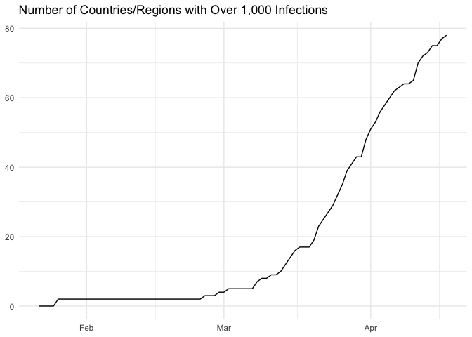
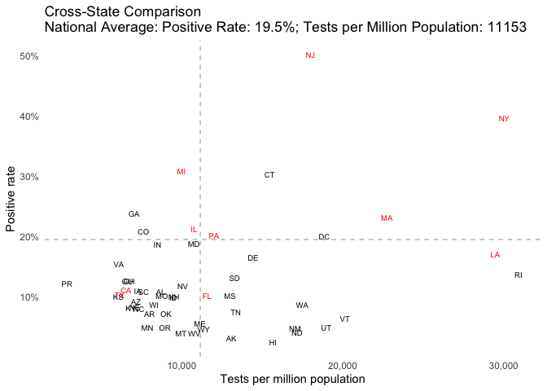

# Visualizing Covid-19 Data

## TLDR

  - Covid-19 has been spreading globally with over 700,000 people
    infected. Over 150,000 people are infected by Covid-19 in the US.
    Disease containment efforts are relatively more effective in some
    Asian countries and regions.
  - The growth in the number of cases has become slower recently, which
    is more likely to be a sign of inadequate tests instead of the
    effectiveness of social distancing efforts.Positive rate of Covid-19
    tests can be used to measure whether sufficient tests has been
    performed relative to the spread of the disease. It grows from 10%
    to 17% in the past 10 days.
  - Dispite the variation in testing policies, we argue that rough
    comparisons in the severity of the spread could be made between
    states with similar numbers of tests per million population. We have
    found, for example, that the spread is more severe in NJ than DC, MI
    than IN and MA than VT.

## Introduction

The goal of this report is to visualize the spread of Covid-19 and to
understand the current situation in terms of where we are in the
dynamics of the spread. We begin by a brief overview of the spread of
Covid-19 across the globe and in the US. We then move onto the closer
scrutiny at the US data at state-level. In particular we visualize the
trajectory of the spread across time for individual states as well as
make some qualititive attempts to compare the state of the spread across
states.

However, due to the different testing policies across the globe and
across the states in the US, comparisons among the countries and states
may be misleading. After all, no one can be confirmed to be infected
with Covid-19 if no test is performed. As such, the use of the figures
in this report as means of prediction is discouraged. Comparisons among
countries and states should also be made cautiously.

In this report, we use the data from [Johns Hopkins
dataset](https://github.com/CSSEGISandData/COVID-19/tree/master/csse_covid_19_data/csse_covid_19_time_series)
(also uploaded in the current repository) for the global overview and
the data from [The COVID Tracking Project](https://covidtracking.com)
for understanding the development in the US. We also use US states
population data (uploaded in this repository) in order to understand the
spread and testing of the virus from the per capita perspective.

This report is written with the data as of March 30th, 2020.

## Overview of the Spread of Covid-19

### Covid-19 is a Global Pandemic

Covid-19 began spreading in China around the beginning of 2020 and
continued to spread globally with around 782,000 people infected with
the disease. The figure
belows

<!-- -->

The disease has been spreading in 178 countries and regions. Currently,
there are 107 countries and regions with over 100 confirmed cases of
Covid-19, and 43 countries and regions with over 1,000 confirmed cases.
These numbers are growing rapidly. Most countries and regions have
reached the 100 and 1000 thresholds around
mid-March.

<!-- --><!-- -->

Among these countries and regions, the following are the hardest-hit
places. \[1\]

    ## # A tibble: 10 x 2
    ##    `Country/Region` `Number of Confirmed Cases`
    ##    <chr>                                  <dbl>
    ##  1 US                                    161807
    ##  2 Italy                                 101739
    ##  3 Spain                                  87956
    ##  4 Hubei                                  67801
    ##  5 Germany                                66885
    ##  6 France                                 45170
    ##  7 Iran                                   41495
    ##  8 UK                                     22453
    ##  9 Switzerland                            15922
    ## 10 China ex Hubei                         13677

The following figure visualizes the trajectory of the spread of Covid-19
in some of the countries and regions. In particular, for each country or
region, we define the date when the number of confirmed cases of
Covid-19 reached 100 as the date of the “outbreak” and plot how the
cumulative number of confirmed cases evolves after the outbreak.\[2\]

It seems that China (both Hubei Province and the rest of China) and
South Korea has controlled the spread with very limited daily growth in
the number of confirmed cases roughly a month after their outbreaks (day
30). The disease is growing at a somewhat controlable rate after the
outbreak in some of the other Asian countries and regions, including
Japan, Singapre Hong Kong and Taiwan. The spread in rest of the
countries in the figure is concerning: the numbers of people infected
are growing rapidly at a “close-to-exponential”
rate.

<!-- -->

We emphasize again that the number of confirmed cases in each country is
affected by its testing policy and capacity, which are not uniform
across the world. Moreover, countries with similar total number of
confirmed cases may differ in the severity of the spread of Covid-19,
due to the difference in total population. As such, while it is tempting
to argue a country is more efficient in containing the virus than
another country, this argument is unfortunately inaccurate.

### Spread of Covid-19 in the US

Now we move onto US data. Currently, there are about NA,000 confirmed
cases of Covid-19 in the US.

The figure below show the dynamics of the spread in the US. The
situation worsens extremely rapidly in late-March, with the number of
cases doubling every 3 days. It also shows the number of incremental
cases reported after the outbreak of Covid-19 in the US. Recently, the
number of cases grows by about 20,000 everyday.

Massive social distancing practices as well as stay-at-home order have
been implemented recently across the nation. While it might still be too
early to carefully analyze their effectiveness, we estimated the average
growth rate in the timeframe between 3 and 7 days from today and use the
estimated rate to “project” the number of cases for the recent 3 days. A
lower actual number of cases then the projected number **might**
indicate a slower growth rate in the most recent days. One can see from
the figure that the “projected” trajectory (grey dashed curve) indeed
lies above the actual
trajectory.

<!-- -->

However, one should not be too optimistic about the current situation
after observing this pattern. It is equally likely that the pattern is
attributed to the inadequate growth in the testing capacity. As we
argued before, the number of cases are constrained by the testing
capacity.

The figure below shows the cumulative number of Covid-19 tests performed
in the US from the outbreak, together with its daily increments.\[3\]
The ability to test Covid-19 infection is foundamental in containing the
virus, as carriers of the virus may be asymptomatic. One can roughly see
that the number of tests grows at the exponential rate from mid-March,
followed by the linear rate in the few week. Therefore, attributing the
slower growth rate in the spread of disease to effective social
distancing measure might be
unwarrented.

<!-- -->

One metric, while it is not a perfect one, to measure if there are
enough tests performed relative to the severity of the spread of disease
is the positive rate, which is the percentage of people with positive
test result among those tested for the virus. Persumably, only those who
have symptoms similar to Covid-19 and the close contacts of infected
people are tested for the virus. Fixing the relative sizes of these two
groups, positive rate is higher when tests are reserved for people with
more severe symptioms or when contact tracing is performed less
agressively. Therefore, higher positive rate suggests insufficient
testing capacity relative to the spread of the disease.

The figure below shows how the positive rate varies in the US after the
outbreak. It starts from about 15% and decreases to the lowest level of
10% in mid-March. After that, the positive rate grows up to the current
level of about 17%. This suggests that the testing capacity of the US is
still inadequate relative to the spread of Covid-19 in the past 10 days.
It also suggests that the slower growth rate in the number of cases in
the recent days, which we noted earlier, may not be attributed to the
effectiveness of social distancing efforts. At least there is not enough
evidence to make this
statement.

<!-- -->

## US State-Level Analysis

We visualize the trajectory of the spread of Covid-19 for the top 10
states in terms of total number of cases in the figure below. Observe
from the figure that WA, NY and CA are the first three states where the
outbreak started: The outbreak occurred more than 20 days ago in these
state. NY, which is the state with the most cases of Covid-19, has
66497, 16636, 6498, 6447, 5752, 5473, 5057, 4896, 4087, 4025, 2877,
2809, 2627, 2571, 1933, 1834, 1786, 1413, 1307, 1221, 1157, 1031, 1020,
1008, 925, 859, 847, 806, 606, 576, 481, 473, 439, 424, 408, 401, 368,
314, 310, 275, 264, 256, 237, 175, 174, 171, 145, 126, 114, 109, 101,
94, 58, 30, 2, NA people contracting the virus. Covid-19 has been
spreading rapidly in NJ and MI: No other state has seen more cases of
Covid-19 than NJ and MI ten days after the
outbreak.

<!-- -->

We study the trajectories of the following states in more details.

#### New York

New York is the state that is hit the hardest by Coronavirus. The figure
below displays the dynamics of the spread of Covid-19 in NY after its
outbreak. The dark red curve represents the number of positive cases
while the grey dashed curve is the projected number based on the average
growth rate in a 5-day window between 3 and 7 days ago. The dark blue
bars captures the daily increments in the number of positive cases. The
light red curve represents the trajectory of NY’s positive rate. Recall
that we have argued that the positive rate of Covid-19 tests measures
the testing capacity relative to the severity of the spread.

The situation in NY is qualitively similar to the overall situation in
the US. This is natural since roughly41% of the positive cases are
contributed by NY. In US, the growth rate seems to become slower in
recent days. Again, this cannot be attributed to the effectiveness of
social distancing policies: It could be alternatively casued by the
limited testing capaicity. Indeed, the positive rate in NY doubles from
10% to 20% in the past 10 days, indicating that tests are insufficient
relative to the spread of the
disease.

<!-- -->

#### California

The situation in CA might be even worse. Testing capacity is not growing
fast enough: Positive rate of Covid-19 test rises from about 10% to over
20% in the past 10 days. Despite the constraining testing capacity, the
growth rate in the number of positive cases accelerates, with the actual
trajectory above the projected trajectory based on the average growth
rate in the past few
days.

<!-- -->

#### Massachusett

There could be good news in MA. The curve of positive rate suggests that
testing capacity is not becoming more constraining. Yet, the growth rate
in the number of positive cases decreases. This might suggest that
social distancing measures are effective in
MA.

<!-- -->

### Testing of Covid-19 at State Level

Testing of Covid-19 is essential since it is the first step to isolating
the infected people and containing the virus. We have already seen a
rapid growthing in the number of tests implemented in the US, and we
break it down at the state level. The following two figures shows the
number of tests and the number of tests per million population performed
in the top 10 states according to the metrics, respectively. While we
have argued that testing capacity is not sufficient relative to the
severity of spread, we also want to point out that the states are making
great effort to catch
up.

<!-- -->

<!-- -->

### Cross-State Comparison

We have used another metric to measure the adequacy of testing capacity
in the analysis above, which is the number of tests per million
population. It measures whether the number of tests performed is
sufficient relative to the population. The advantage of this metric,
compared with the positive rate, is that it is not affected by the
testing policies that varies across states. However, the disadvantage is
that it is not linked to the scale of the spread of the disease: We need
more tests when the spread is more severe.

We propose the following way to make cross-state comparison, which is
demonstrated by the figure below. We conjecture that each state
prioritizes testing those who are more likely to be infected by
Covid-19, including symptomatic patients as well as close contacts of
infected people. When two states have performed the same number of tests
per million population, their tests should cover the groups of people
who are equaly likely to be infected. Therefore, the comparison of the
positive rate of Covid-19 tests between such two states should coincide
with the relative severities of the spreads among the people with high
risk, which is closely related to the relative severities of the spreads
in the states.

Based on this logic and the figure below, we can argue, for example,
that the spread is more severe in NY than WA, that it is more severe in
NJ than DC, and that it is more severe in MI than
IN.

<!-- -->

    ## List of 59
    ##  $ line                 :List of 6
    ##   ..$ colour       : chr "black"
    ##   ..$ size         : num 0.5
    ##   ..$ linetype     : num 1
    ##   ..$ lineend      : chr "butt"
    ##   ..$ arrow        : logi FALSE
    ##   ..$ inherit.blank: logi TRUE
    ##   ..- attr(*, "class")= chr [1:2] "element_line" "element"
    ##  $ rect                 :List of 5
    ##   ..$ fill         : chr "white"
    ##   ..$ colour       : chr "black"
    ##   ..$ size         : num 0.5
    ##   ..$ linetype     : num 1
    ##   ..$ inherit.blank: logi TRUE
    ##   ..- attr(*, "class")= chr [1:2] "element_rect" "element"
    ##  $ text                 :List of 11
    ##   ..$ family       : chr ""
    ##   ..$ face         : chr "plain"
    ##   ..$ colour       : chr "black"
    ##   ..$ size         : num 11
    ##   ..$ hjust        : num 0.5
    ##   ..$ vjust        : num 0.5
    ##   ..$ angle        : num 0
    ##   ..$ lineheight   : num 0.9
    ##   ..$ margin       : 'margin' num [1:4] 0pt 0pt 0pt 0pt
    ##   .. ..- attr(*, "valid.unit")= int 8
    ##   .. ..- attr(*, "unit")= chr "pt"
    ##   ..$ debug        : logi FALSE
    ##   ..$ inherit.blank: logi TRUE
    ##   ..- attr(*, "class")= chr [1:2] "element_text" "element"
    ##  $ axis.title.x         :List of 11
    ##   ..$ family       : NULL
    ##   ..$ face         : NULL
    ##   ..$ colour       : NULL
    ##   ..$ size         : NULL
    ##   ..$ hjust        : NULL
    ##   ..$ vjust        : num 1
    ##   ..$ angle        : NULL
    ##   ..$ lineheight   : NULL
    ##   ..$ margin       : 'margin' num [1:4] 2.75pt 0pt 0pt 0pt
    ##   .. ..- attr(*, "valid.unit")= int 8
    ##   .. ..- attr(*, "unit")= chr "pt"
    ##   ..$ debug        : NULL
    ##   ..$ inherit.blank: logi TRUE
    ##   ..- attr(*, "class")= chr [1:2] "element_text" "element"
    ##  $ axis.title.x.top     :List of 11
    ##   ..$ family       : NULL
    ##   ..$ face         : NULL
    ##   ..$ colour       : NULL
    ##   ..$ size         : NULL
    ##   ..$ hjust        : NULL
    ##   ..$ vjust        : num 0
    ##   ..$ angle        : NULL
    ##   ..$ lineheight   : NULL
    ##   ..$ margin       : 'margin' num [1:4] 0pt 0pt 2.75pt 0pt
    ##   .. ..- attr(*, "valid.unit")= int 8
    ##   .. ..- attr(*, "unit")= chr "pt"
    ##   ..$ debug        : NULL
    ##   ..$ inherit.blank: logi TRUE
    ##   ..- attr(*, "class")= chr [1:2] "element_text" "element"
    ##  $ axis.title.y         :List of 11
    ##   ..$ family       : NULL
    ##   ..$ face         : NULL
    ##   ..$ colour       : NULL
    ##   ..$ size         : NULL
    ##   ..$ hjust        : NULL
    ##   ..$ vjust        : num 1
    ##   ..$ angle        : num 90
    ##   ..$ lineheight   : NULL
    ##   ..$ margin       : 'margin' num [1:4] 0pt 2.75pt 0pt 0pt
    ##   .. ..- attr(*, "valid.unit")= int 8
    ##   .. ..- attr(*, "unit")= chr "pt"
    ##   ..$ debug        : NULL
    ##   ..$ inherit.blank: logi TRUE
    ##   ..- attr(*, "class")= chr [1:2] "element_text" "element"
    ##  $ axis.title.y.right   :List of 11
    ##   ..$ family       : NULL
    ##   ..$ face         : NULL
    ##   ..$ colour       : NULL
    ##   ..$ size         : NULL
    ##   ..$ hjust        : NULL
    ##   ..$ vjust        : num 0
    ##   ..$ angle        : num -90
    ##   ..$ lineheight   : NULL
    ##   ..$ margin       : 'margin' num [1:4] 0pt 0pt 0pt 2.75pt
    ##   .. ..- attr(*, "valid.unit")= int 8
    ##   .. ..- attr(*, "unit")= chr "pt"
    ##   ..$ debug        : NULL
    ##   ..$ inherit.blank: logi TRUE
    ##   ..- attr(*, "class")= chr [1:2] "element_text" "element"
    ##  $ axis.text            :List of 11
    ##   ..$ family       : NULL
    ##   ..$ face         : NULL
    ##   ..$ colour       : chr "grey30"
    ##   ..$ size         : 'rel' num 0.8
    ##   ..$ hjust        : NULL
    ##   ..$ vjust        : NULL
    ##   ..$ angle        : NULL
    ##   ..$ lineheight   : NULL
    ##   ..$ margin       : NULL
    ##   ..$ debug        : NULL
    ##   ..$ inherit.blank: logi TRUE
    ##   ..- attr(*, "class")= chr [1:2] "element_text" "element"
    ##  $ axis.text.x          :List of 11
    ##   ..$ family       : NULL
    ##   ..$ face         : NULL
    ##   ..$ colour       : NULL
    ##   ..$ size         : NULL
    ##   ..$ hjust        : NULL
    ##   ..$ vjust        : num 1
    ##   ..$ angle        : NULL
    ##   ..$ lineheight   : NULL
    ##   ..$ margin       : 'margin' num [1:4] 2.2pt 0pt 0pt 0pt
    ##   .. ..- attr(*, "valid.unit")= int 8
    ##   .. ..- attr(*, "unit")= chr "pt"
    ##   ..$ debug        : NULL
    ##   ..$ inherit.blank: logi TRUE
    ##   ..- attr(*, "class")= chr [1:2] "element_text" "element"
    ##  $ axis.text.x.top      :List of 11
    ##   ..$ family       : NULL
    ##   ..$ face         : NULL
    ##   ..$ colour       : NULL
    ##   ..$ size         : NULL
    ##   ..$ hjust        : NULL
    ##   ..$ vjust        : num 0
    ##   ..$ angle        : NULL
    ##   ..$ lineheight   : NULL
    ##   ..$ margin       : 'margin' num [1:4] 0pt 0pt 2.2pt 0pt
    ##   .. ..- attr(*, "valid.unit")= int 8
    ##   .. ..- attr(*, "unit")= chr "pt"
    ##   ..$ debug        : NULL
    ##   ..$ inherit.blank: logi TRUE
    ##   ..- attr(*, "class")= chr [1:2] "element_text" "element"
    ##  $ axis.text.y          :List of 11
    ##   ..$ family       : NULL
    ##   ..$ face         : NULL
    ##   ..$ colour       : NULL
    ##   ..$ size         : NULL
    ##   ..$ hjust        : num 1
    ##   ..$ vjust        : NULL
    ##   ..$ angle        : NULL
    ##   ..$ lineheight   : NULL
    ##   ..$ margin       : 'margin' num [1:4] 0pt 2.2pt 0pt 0pt
    ##   .. ..- attr(*, "valid.unit")= int 8
    ##   .. ..- attr(*, "unit")= chr "pt"
    ##   ..$ debug        : NULL
    ##   ..$ inherit.blank: logi TRUE
    ##   ..- attr(*, "class")= chr [1:2] "element_text" "element"
    ##  $ axis.text.y.right    :List of 11
    ##   ..$ family       : NULL
    ##   ..$ face         : NULL
    ##   ..$ colour       : NULL
    ##   ..$ size         : NULL
    ##   ..$ hjust        : num 0
    ##   ..$ vjust        : NULL
    ##   ..$ angle        : NULL
    ##   ..$ lineheight   : NULL
    ##   ..$ margin       : 'margin' num [1:4] 0pt 0pt 0pt 2.2pt
    ##   .. ..- attr(*, "valid.unit")= int 8
    ##   .. ..- attr(*, "unit")= chr "pt"
    ##   ..$ debug        : NULL
    ##   ..$ inherit.blank: logi TRUE
    ##   ..- attr(*, "class")= chr [1:2] "element_text" "element"
    ##  $ axis.ticks           : list()
    ##   ..- attr(*, "class")= chr [1:2] "element_blank" "element"
    ##  $ axis.ticks.length    : 'unit' num 2.75pt
    ##   ..- attr(*, "valid.unit")= int 8
    ##   ..- attr(*, "unit")= chr "pt"
    ##  $ axis.line            : list()
    ##   ..- attr(*, "class")= chr [1:2] "element_blank" "element"
    ##  $ axis.line.x          : NULL
    ##  $ axis.line.y          : NULL
    ##  $ legend.background    : list()
    ##   ..- attr(*, "class")= chr [1:2] "element_blank" "element"
    ##  $ legend.margin        : 'margin' num [1:4] 5.5pt 5.5pt 5.5pt 5.5pt
    ##   ..- attr(*, "valid.unit")= int 8
    ##   ..- attr(*, "unit")= chr "pt"
    ##  $ legend.spacing       : 'unit' num 11pt
    ##   ..- attr(*, "valid.unit")= int 8
    ##   ..- attr(*, "unit")= chr "pt"
    ##  $ legend.spacing.x     : NULL
    ##  $ legend.spacing.y     : NULL
    ##  $ legend.key           : list()
    ##   ..- attr(*, "class")= chr [1:2] "element_blank" "element"
    ##  $ legend.key.size      : 'unit' num 1.2lines
    ##   ..- attr(*, "valid.unit")= int 3
    ##   ..- attr(*, "unit")= chr "lines"
    ##  $ legend.key.height    : NULL
    ##  $ legend.key.width     : NULL
    ##  $ legend.text          :List of 11
    ##   ..$ family       : NULL
    ##   ..$ face         : NULL
    ##   ..$ colour       : NULL
    ##   ..$ size         : 'rel' num 0.8
    ##   ..$ hjust        : NULL
    ##   ..$ vjust        : NULL
    ##   ..$ angle        : NULL
    ##   ..$ lineheight   : NULL
    ##   ..$ margin       : NULL
    ##   ..$ debug        : NULL
    ##   ..$ inherit.blank: logi TRUE
    ##   ..- attr(*, "class")= chr [1:2] "element_text" "element"
    ##  $ legend.text.align    : NULL
    ##  $ legend.title         :List of 11
    ##   ..$ family       : NULL
    ##   ..$ face         : NULL
    ##   ..$ colour       : NULL
    ##   ..$ size         : NULL
    ##   ..$ hjust        : num 0
    ##   ..$ vjust        : NULL
    ##   ..$ angle        : NULL
    ##   ..$ lineheight   : NULL
    ##   ..$ margin       : NULL
    ##   ..$ debug        : NULL
    ##   ..$ inherit.blank: logi TRUE
    ##   ..- attr(*, "class")= chr [1:2] "element_text" "element"
    ##  $ legend.title.align   : NULL
    ##  $ legend.position      : chr "right"
    ##  $ legend.direction     : NULL
    ##  $ legend.justification : chr "center"
    ##  $ legend.box           : NULL
    ##  $ legend.box.margin    : 'margin' num [1:4] 0cm 0cm 0cm 0cm
    ##   ..- attr(*, "valid.unit")= int 1
    ##   ..- attr(*, "unit")= chr "cm"
    ##  $ legend.box.background: list()
    ##   ..- attr(*, "class")= chr [1:2] "element_blank" "element"
    ##  $ legend.box.spacing   : 'unit' num 11pt
    ##   ..- attr(*, "valid.unit")= int 8
    ##   ..- attr(*, "unit")= chr "pt"
    ##  $ panel.background     : list()
    ##   ..- attr(*, "class")= chr [1:2] "element_blank" "element"
    ##  $ panel.border         : list()
    ##   ..- attr(*, "class")= chr [1:2] "element_blank" "element"
    ##  $ panel.spacing        : 'unit' num 5.5pt
    ##   ..- attr(*, "valid.unit")= int 8
    ##   ..- attr(*, "unit")= chr "pt"
    ##  $ panel.spacing.x      : NULL
    ##  $ panel.spacing.y      : NULL
    ##  $ panel.grid           :List of 6
    ##   ..$ colour       : chr "grey92"
    ##   ..$ size         : NULL
    ##   ..$ linetype     : NULL
    ##   ..$ lineend      : NULL
    ##   ..$ arrow        : logi FALSE
    ##   ..$ inherit.blank: logi TRUE
    ##   ..- attr(*, "class")= chr [1:2] "element_line" "element"
    ##  $ panel.grid.minor     :List of 6
    ##   ..$ colour       : NULL
    ##   ..$ size         : 'rel' num 0.5
    ##   ..$ linetype     : NULL
    ##   ..$ lineend      : NULL
    ##   ..$ arrow        : logi FALSE
    ##   ..$ inherit.blank: logi TRUE
    ##   ..- attr(*, "class")= chr [1:2] "element_line" "element"
    ##  $ panel.ontop          : logi FALSE
    ##  $ plot.background      : list()
    ##   ..- attr(*, "class")= chr [1:2] "element_blank" "element"
    ##  $ plot.title           :List of 11
    ##   ..$ family       : NULL
    ##   ..$ face         : NULL
    ##   ..$ colour       : NULL
    ##   ..$ size         : 'rel' num 1.2
    ##   ..$ hjust        : num 0
    ##   ..$ vjust        : num 1
    ##   ..$ angle        : NULL
    ##   ..$ lineheight   : NULL
    ##   ..$ margin       : 'margin' num [1:4] 0pt 0pt 5.5pt 0pt
    ##   .. ..- attr(*, "valid.unit")= int 8
    ##   .. ..- attr(*, "unit")= chr "pt"
    ##   ..$ debug        : NULL
    ##   ..$ inherit.blank: logi TRUE
    ##   ..- attr(*, "class")= chr [1:2] "element_text" "element"
    ##  $ plot.subtitle        :List of 11
    ##   ..$ family       : NULL
    ##   ..$ face         : NULL
    ##   ..$ colour       : NULL
    ##   ..$ size         : NULL
    ##   ..$ hjust        : num 0
    ##   ..$ vjust        : num 1
    ##   ..$ angle        : NULL
    ##   ..$ lineheight   : NULL
    ##   ..$ margin       : 'margin' num [1:4] 0pt 0pt 5.5pt 0pt
    ##   .. ..- attr(*, "valid.unit")= int 8
    ##   .. ..- attr(*, "unit")= chr "pt"
    ##   ..$ debug        : NULL
    ##   ..$ inherit.blank: logi TRUE
    ##   ..- attr(*, "class")= chr [1:2] "element_text" "element"
    ##  $ plot.caption         :List of 11
    ##   ..$ family       : NULL
    ##   ..$ face         : NULL
    ##   ..$ colour       : NULL
    ##   ..$ size         : 'rel' num 0.8
    ##   ..$ hjust        : num 1
    ##   ..$ vjust        : num 1
    ##   ..$ angle        : NULL
    ##   ..$ lineheight   : NULL
    ##   ..$ margin       : 'margin' num [1:4] 5.5pt 0pt 0pt 0pt
    ##   .. ..- attr(*, "valid.unit")= int 8
    ##   .. ..- attr(*, "unit")= chr "pt"
    ##   ..$ debug        : NULL
    ##   ..$ inherit.blank: logi TRUE
    ##   ..- attr(*, "class")= chr [1:2] "element_text" "element"
    ##  $ plot.tag             :List of 11
    ##   ..$ family       : NULL
    ##   ..$ face         : NULL
    ##   ..$ colour       : NULL
    ##   ..$ size         : 'rel' num 1.2
    ##   ..$ hjust        : num 0.5
    ##   ..$ vjust        : num 0.5
    ##   ..$ angle        : NULL
    ##   ..$ lineheight   : NULL
    ##   ..$ margin       : NULL
    ##   ..$ debug        : NULL
    ##   ..$ inherit.blank: logi TRUE
    ##   ..- attr(*, "class")= chr [1:2] "element_text" "element"
    ##  $ plot.tag.position    : chr "topleft"
    ##  $ plot.margin          : 'margin' num [1:4] 5.5pt 5.5pt 5.5pt 5.5pt
    ##   ..- attr(*, "valid.unit")= int 8
    ##   ..- attr(*, "unit")= chr "pt"
    ##  $ strip.background     : list()
    ##   ..- attr(*, "class")= chr [1:2] "element_blank" "element"
    ##  $ strip.placement      : chr "inside"
    ##  $ strip.text           :List of 11
    ##   ..$ family       : NULL
    ##   ..$ face         : NULL
    ##   ..$ colour       : chr "grey10"
    ##   ..$ size         : 'rel' num 0.8
    ##   ..$ hjust        : NULL
    ##   ..$ vjust        : NULL
    ##   ..$ angle        : NULL
    ##   ..$ lineheight   : NULL
    ##   ..$ margin       : 'margin' num [1:4] 4.4pt 4.4pt 4.4pt 4.4pt
    ##   .. ..- attr(*, "valid.unit")= int 8
    ##   .. ..- attr(*, "unit")= chr "pt"
    ##   ..$ debug        : NULL
    ##   ..$ inherit.blank: logi TRUE
    ##   ..- attr(*, "class")= chr [1:2] "element_text" "element"
    ##  $ strip.text.x         : NULL
    ##  $ strip.text.y         :List of 11
    ##   ..$ family       : NULL
    ##   ..$ face         : NULL
    ##   ..$ colour       : NULL
    ##   ..$ size         : NULL
    ##   ..$ hjust        : NULL
    ##   ..$ vjust        : NULL
    ##   ..$ angle        : num -90
    ##   ..$ lineheight   : NULL
    ##   ..$ margin       : NULL
    ##   ..$ debug        : NULL
    ##   ..$ inherit.blank: logi TRUE
    ##   ..- attr(*, "class")= chr [1:2] "element_text" "element"
    ##  $ strip.switch.pad.grid: 'unit' num 2.75pt
    ##   ..- attr(*, "valid.unit")= int 8
    ##   ..- attr(*, "unit")= chr "pt"
    ##  $ strip.switch.pad.wrap: 'unit' num 2.75pt
    ##   ..- attr(*, "valid.unit")= int 8
    ##   ..- attr(*, "unit")= chr "pt"
    ##  - attr(*, "class")= chr [1:2] "theme" "gg"
    ##  - attr(*, "complete")= logi TRUE
    ##  - attr(*, "validate")= logi TRUE

### One Figure with Rich Information

We finally provide a figure that converys the latests Covid-19 data of
each state in the US. The dashed line represents the national average
positive rate: about 17 people are infected by the Coronavirus our of
every hundred people tested. Each “bubble” in the figure represents a
state and is placed according to the number of tests and number of cases
of Covid-19 (in log-scale). The color of a “bubble” captures the
positive rate of the tests performed by the state and the size of a
“bubble” captures the number of tests performed per million
population. We only visualize the data for a selected set of states
given the limited size of figure, but more states could be added to the
figure.

<!-- -->

1.  Notice that we treat Hubei Province and the rest of China
    separatedly in our report.

2.  We set the outbreak of Hubei Provence as Jan 19. While data is not
    available from JHU before Jan 22, we have checked from other data
    source that the number of confirmed cases has reached 100 for Hubei
    on that day.

3.  Tests with pending results are excluded.
